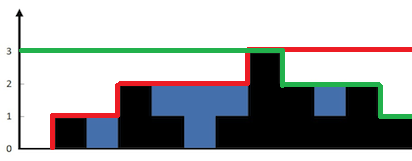

# Trapping Rain Water
Given `n` non-negative integers representing an elevation map where the width of each bar is `1`, compute how much water it can trap after raining.

## Example


```go
Input: height = [0,1,0,2,1,0,1,3,2,1,2,1]
Output: 6
```
Explanation: The above elevation `map` (black section) is represented by array `[0,1,0,2,1,0,1,3,2,1,2,1]`. 
In this case, 6 units of rain water (blue section) are being trapped.

## Solution



- Calculate the height of `green` color by `i` from `length - 2` to `0`, `right[i] = max(height[i], right[i + 1])`
- Calculate the height of `red` the same rule above but `i` from `0` to `length - 1`
- The result will be `min(left, right) - height`

```go
func trap(height []int) int {
    length := len(height)
    // if len = 0 return 0
    if length == 0 {
         return 0
    }
    
    // find the max from left
    left := make([]int, length)
    left[0] = height[0]
    right := make([]int, length)
    right[length - 1] = height[length - 1]

    for i := 1; i < length; i++ {
        left[i] = max(height[i], left[i - 1])
        right[length - 1 - i] = max(height[length - 1 - i], right[length - i])
    }
    
    // now find the water
    total := 0
    for i := 0; i < length; i++ {
        total += min(left[i], right[i]) - height[i]
    }
    return total
}

func max(left int, right int) int {
    if left > right {
        return left
    }
    return right
}

func min(left int, right int) int {
    if left > right {
        return right
    }
    return left
}
```

Complexity O(n)
Space complexity O(n)
